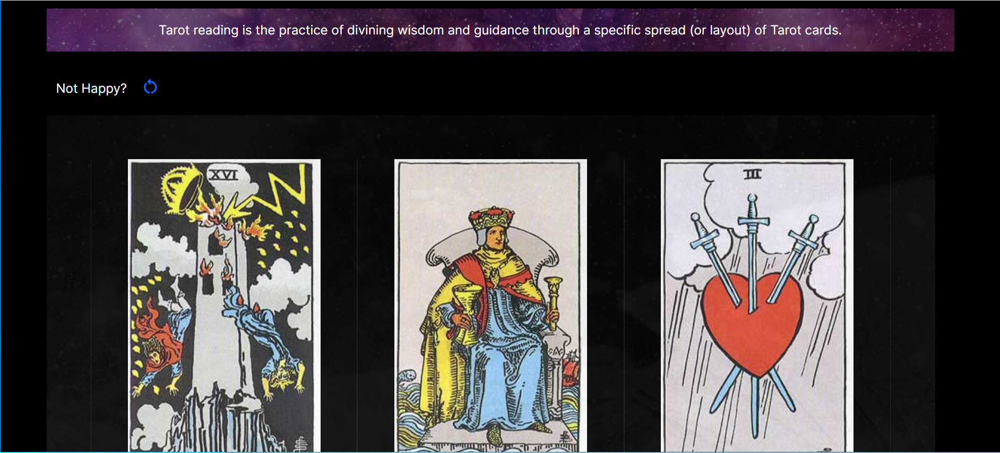
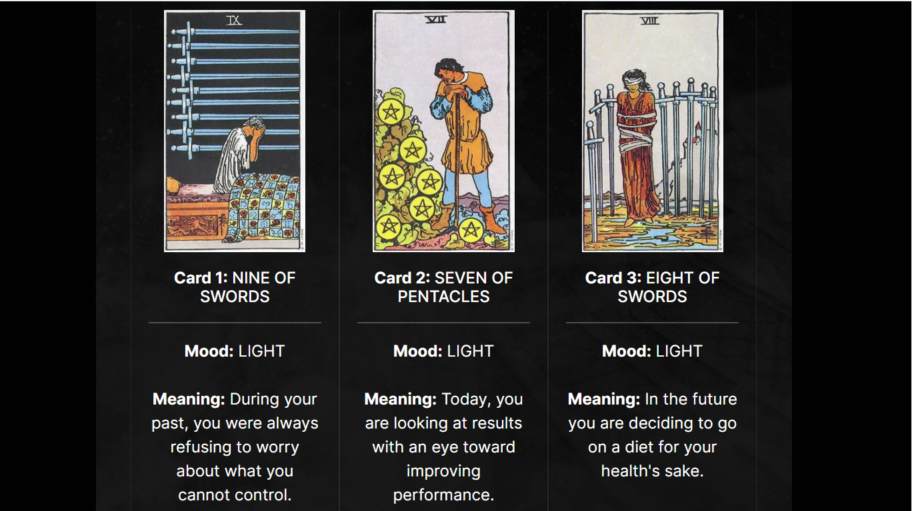
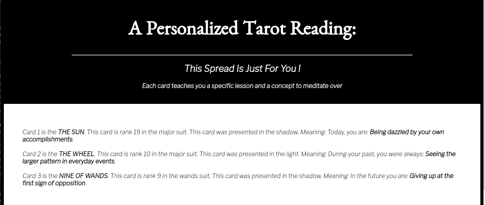

# Project 16: Mixed Messages

## Premise
In this project, you’ll build a message generator program that outputs a new, random message every time a user runs the program. Your program should showcase JavaScript syntax and programming concepts. You can take the project in several forms, like an astrology generator, inspirational message, or nonsensical jokes. To make your program truly random, the message it outputs should comprise at least three different pieces of data.

## Prerequisites:
- JavaScript
- Git and GitHub
- Command line

---

## Code Explanation

This project attempts to simulate a three-card spread tarot card reading. It begins with the creation of a JSON file. Each element in the JSON is an object that holds the data of a tarot card. Credit to [@dariusk](https://github.com/dariusk/corpora/blob/master/data/divination/tarot_interpretations.json) for providing the original tarot card objects. The current objects used in this project were modified to include card images. 

Through a series of functions, 3 tarot card objects are randomly selected from the data retrieved from the JSON, and 3 moods are also randomly selected. The moods will determine the meaning of the selected cards. A final function (<b>messageBuilder</b>) takes the data previously collected and, through string interpolation, composes a message that will be presented to the user. The user can refresh the page to receive a new reading.

## Current Design

## Past Version

### Card Layout

### Card Meaning

## Version 1
  
